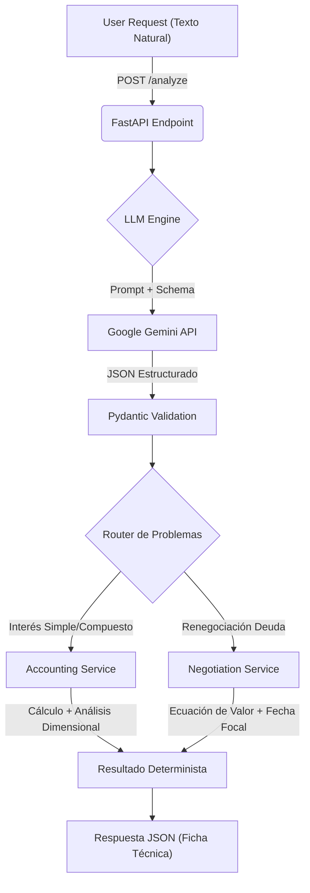

# 🧠 Neuro-Symbolic Financial Engine

> Un motor de análisis financiero que combina la comprensión del lenguaje natural (LLMs) con la precisión determinista de motores de cálculo matemático (Python).


## 📖 Descripción

Este proyecto resuelve el problema fundamental de usar IA generativa en Finanzas: **la alucinación numérica**. 

En lugar de pedirle al LLM que "calcule" (lo cual suele fallar), utilizamos una arquitectura **Neuro-Simbólica**:
1.  **Fase Neuro (IA):** Un modelo de lenguaje (Gemini Flash) extrae entidades, intenciones y datos estructurados del texto del usuario.
2.  **Fase Simbólica (Código):** Un motor matemático en Python (basado en principios actuariales) ejecuta los cálculos con precisión de punto flotante, análisis dimensional y trazabilidad.

## 🚀 Características Clave

* **Zero-Hallucination Math:** Los cálculos no los hace la IA, los hacen algoritmos de Python probados.
* **Análisis Dimensional:** Distingue inteligentemente entre Tiempo cronológico ($t$) y Número de Periodos ($n$) según la frecuencia de capitalización.
* **API RESTful:** Expuesto mediante **FastAPI** para fácil integración con Frontends o Apps Móviles.
* **Auditoría Completa:** Genera una "Ficha Técnica" detallada ($C, M, I, r, i, t, n$) y desgloses paso a paso de Ecuaciones de Valor.
* **Resiliencia:** Implementación de *Exponential Backoff* con `tenacity` para manejar límites de cuota de la API de IA.
* **Cost-Effective:** Optimizado para modelos ligeros (Gemini 1.5 Flash / 2.0 Flash Lite).

## 🛠️ Arquitectura



## 📦 Instalación

1.  **Clonar el repositorio:**
    ```bash
    git clone [https://github.com/TU_USUARIO/financial-system.git](https://github.com/TU_USUARIO/financial-system.git)
    cd financial-system
    ```

2.  **Crear entorno virtual:**
    ```bash
    python -m venv venv
    # Windows:
    .\venv\Scripts\activate
    # Mac/Linux:
    source venv/bin/activate
    ```

3.  **Instalar dependencias:**
    ```bash
    pip install -r requirements.txt
    ```
    *(Nota: Asegúrate de tener `fastapi`, `uvicorn`, `google-genai`, `instructor`, `pydantic`, `python-dotenv`, `tenacity`)*

4.  **Configurar Variables de Entorno:**
    Renombra `.env.example` a `.env` y coloca tu API Key:
    ```ini
    LLM_PROVIDER=gemini
    GEMINI_API_KEY=tu_api_key_aqui
    MODEL_NAME=gemini-1.5-flash
    ```

## ▶️ Uso

1.  **Levantar el Servidor:**
    ```bash
    uvicorn app.entrypoints.api.main:app --reload
    ```

2.  **Probar la API (Swagger UI):**
    Abre tu navegador en `http://127.0.0.1:8000/docs`.

3.  **Ejemplo de Petición (JSON):**
    *Endpoint:* `POST /analyze`
    ```json
    {
      "text": "Solicitamos un préstamo de 50,000 a 2 años, tasa del 16% anual. Determinar costo y valor final."
    }
    ```

4.  **Ejemplo de Respuesta:**
    ```json
    {
      "status": "success",
      "financial_data": {
        "resumen": {
          "variables_monetarias": {
            "C": 50000.0,
            "M": 66000.0,
            "I": 16000.0
          },
          "variables_tasa": {
            "r": 0.16,
            "freq": "Anual"
          }
        }
      }
    }
    ```

## 📂 Estructura del Proyecto

* `app/entrypoints`: Controladores de API (FastAPI).
* `app/accounting`: Lógica de Interés Simple/Compuesto.
* `app/negotiation`: Lógica de Ecuaciones de Valor y Renegociaciones.
* `app/llm_engine.py`: Cliente de IA con manejo de reintentos.
* `app/llm_schema_registry.py`: Definiciones Pydantic para la IA.

## 🛡️ Licencia

Este proyecto es privado y confidencial por el momento.
